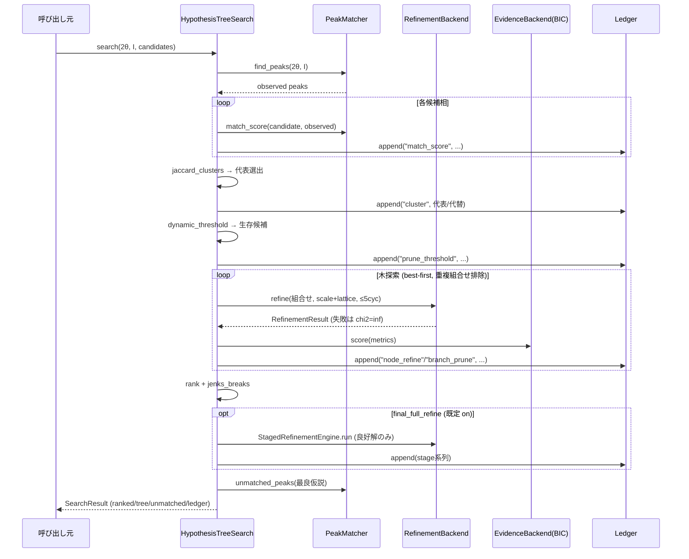
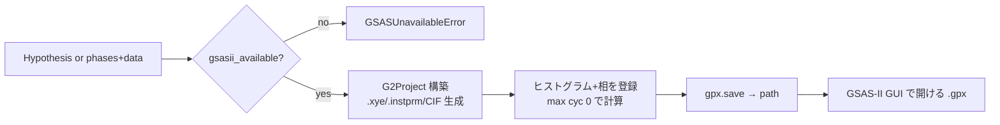
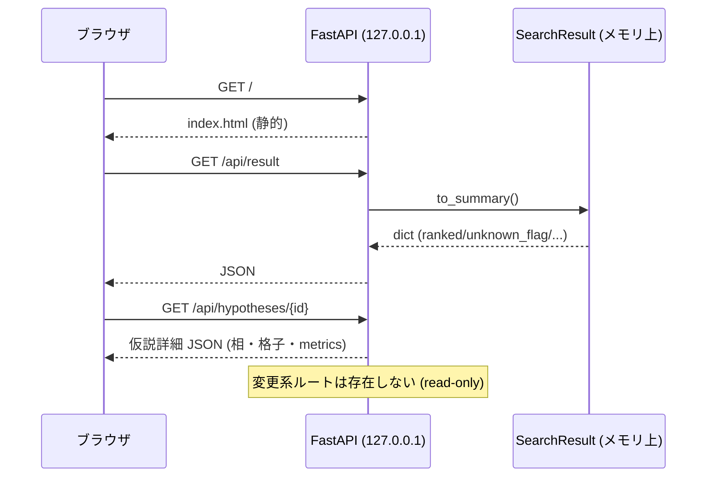

# m1-hypothesis-search データフロー図

**作成日**: 2026-07-03
**関連アーキテクチャ**: [architecture.md](architecture.md)
**関連要件定義**: [requirements.md](../../spec/m1-hypothesis-search/requirements.md)

**【信頼性レベル凡例】**: 🔵 要件・仕様に依拠 / 🟡 妥当な推測 / 🔴 根拠なし推測

---

## 木探索の全体フロー 🔵

**信頼性**: 🔵 *FR-110〜117 / REQ-001〜106*

```mermaid
flowchart TD
    A[観測パターン 2θ, I] --> B[find_peaks: 観測ピーク検出]
    C[候補相集合 PhaseCandidate*N] --> D[match_score: 相ごとのマッチング]
    B --> D
    D --> E[jaccard_clusters: 等構造縮約\n代表=FoM最大, 他は alternatives]
    E --> F[dynamic_threshold: 変曲点枝刈り\n(候補<4 は全展開)]
    F --> G[木探索 best-first]
    G --> G1[ノード=相組合せ\nbackend.refine 探索モード\nscale+lattice, ≤5cycles]
    G1 --> G2{Rwp改善 ≥ 2pt?}
    G2 -->|yes, 相数<5| G
    G2 -->|no| G3[枝打ち切り\nledger: prune 記録]
    G1 --> H[BIC 一次評価\nmetrics.evidence]
    H --> I[rank: softmax確率+僅差競合]
    I --> J[jenks_breaks: 良好解クラスタ]
    J --> K[StagedRefinementEngine\n良好解のみフル精密化 🟡]
    K --> L[unmatched_peaks: 未マッチ報告\n未知相フラグ]
    L --> M[SearchResult]

    G1 -.->|全操作| N[(Ledger 追記)]
    K -.-> N
    G3 -.-> N
```

## シーケンス: search() 呼び出し 🔵



## .gpx 書き出しフロー 🔵

**信頼性**: 🔵 *FR-505 / M0 GSASIIBackend の経路*



## Web UI データフロー 🟡

**信頼性**: 🟡 *interview Q2 の確定案*



## エラーハンドリングフロー 🔵

**信頼性**: 🔵 *EDGE-001〜004 / M0 規約*

```mermaid
flowchart TD
    A{事象} -->|候補ゼロ| B[空 SearchResult, 例外なし]
    A -->|観測ピークなし| C[全スコア0 → 空良好解+警告フィールド]
    A -->|ノード精密化失敗| D[chi2=inf → 当該枝降格, 探索続行]
    A -->|全仮説高R| E[unknown_phase_flag=True + 要確認]
    A -->|.gpx & GSAS-II未導入| F[GSASUnavailableError 送出]
    A -->|不明な hypothesis id (Web)| G[404 JSON]
```

## データ整合性 🔵

- SearchResult 内の全 ID (`hyp-XXXX`) は reports / ranked / tree で一意・整合 (M0 pipeline 規約)
- ledger は search() ごとに単一インスタンス、`verify()` True を保証
- 仮説の親子関係は parent_id のみで表現 (グラフ構造の別持ちはしない — 単一情報源)

## 信頼性レベルサマリー

- 🔵: 5 フロー / 🟡: 1 フロー (Web UI) / 🔴: 0

**品質評価**: 高品質
