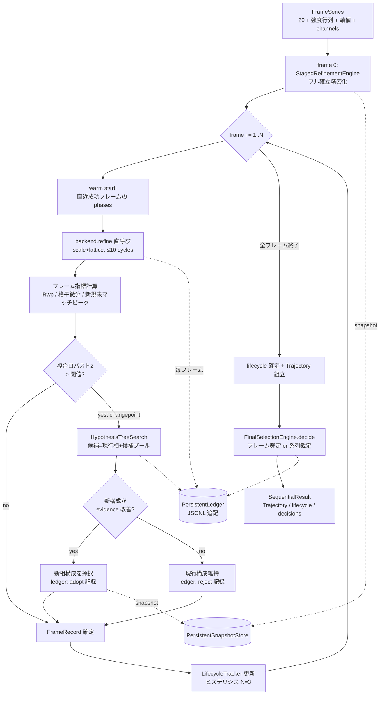
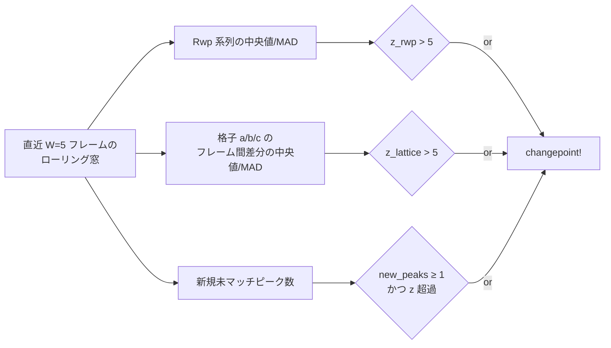
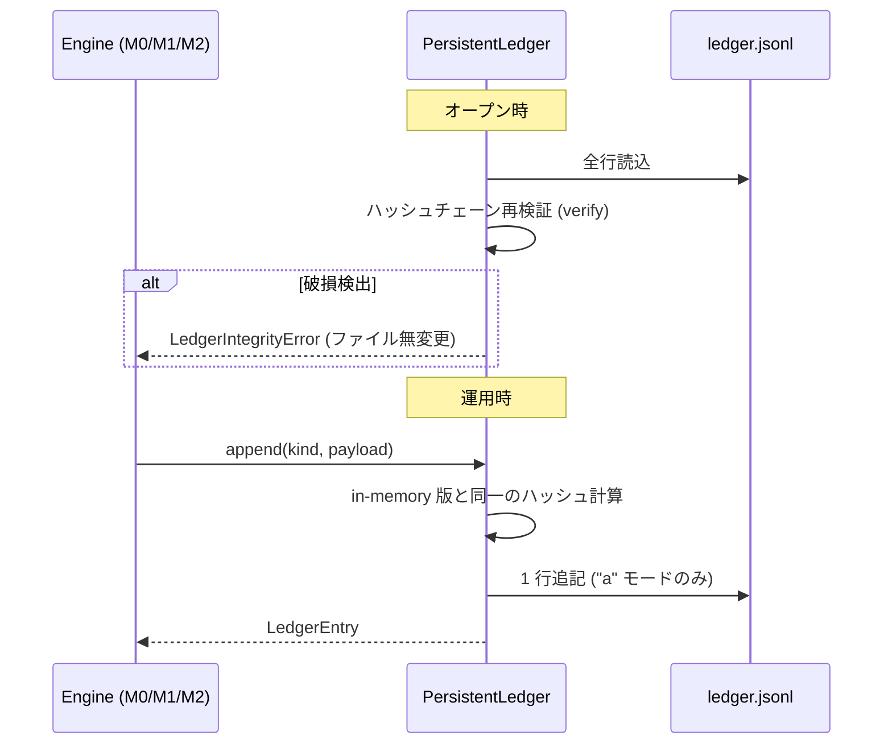
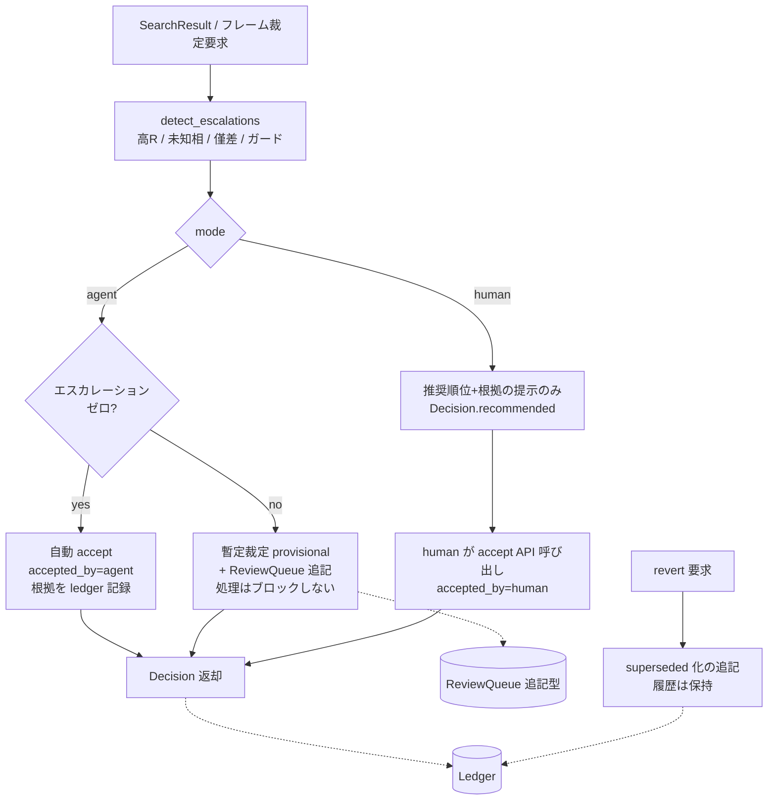
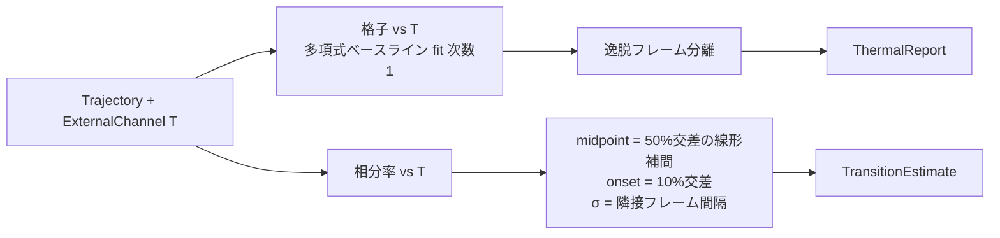
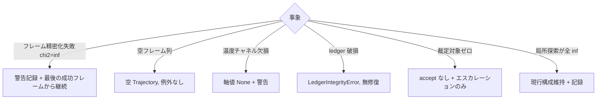

# m2-sequential データフロー図

**作成日**: 2026-07-03
**関連**: [architecture.md](architecture.md) / [requirements.md](../../spec/m2-sequential/requirements.md)

**【信頼性レベル凡例】**: 🔵 要件・仕様に依拠 / 🟡 妥当な推測 / 🔴 根拠なし推測

---

## シーケンシャル解析の全体フロー 🔵

**信頼性**: 🔵 *FR-301/303/304/305/306 (オンライン単一パスは 🟡 D1)*

## changepoint 複合指標 🔵 (式は 🟡)

- 各指標は独立に検出可能 (TC-102-06)。窓が W 未満の序盤は検出をスキップ (warm-up) 🟡

## 永続化フロー 🔵

## 最終選択 2 モードのフロー 🔵

**信頼性**: 🔵 *FR-402/403*

## 高温モードのフロー 🔵

## エラーハンドリングフロー 🔵

## データ整合性 🔵

- Trajectory の行数 = フレーム数 (失敗フレームも None 値入りで 1 行、TC-104-03)
- `Hypothesis.frame_range` は採択区間 [start, end] を保持し、系譜は parent_id (単一情報源)
- 永続 ledger のエントリ index は再オープン跨ぎで連番継続 (verify で保証)

## 信頼性レベルサマリー

- 🔵: 6 フロー / 🟡: 2 (オンライン方式・warm-up) / 🔴: 0 — **品質評価**: 高品質
