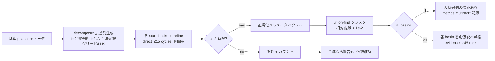
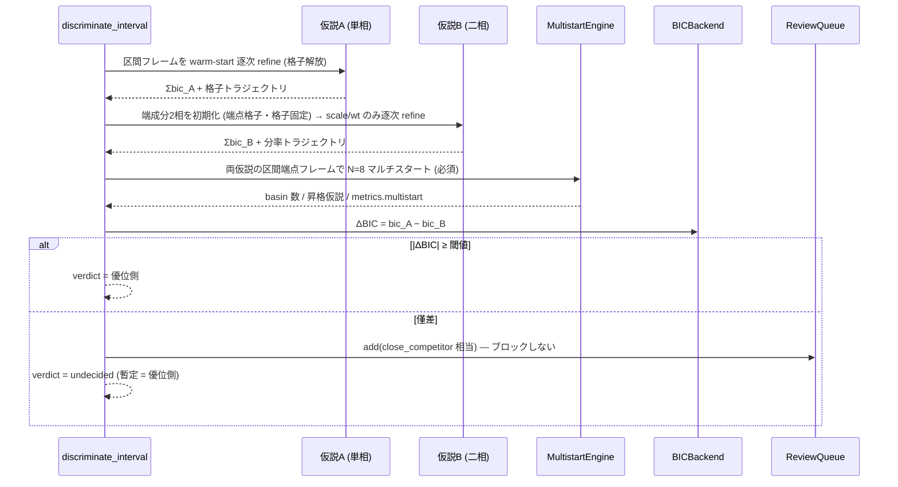
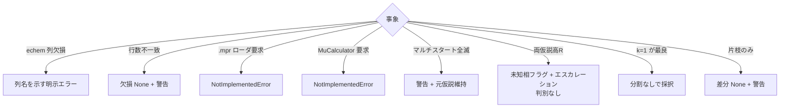

# m3-operando データフロー図

**作成日**: 2026-07-03
**関連**: [architecture.md](architecture.md) / [requirements.md](../../spec/m3-operando/requirements.md)

**【信頼性レベル凡例】**: 🔵 要件・仕様に依拠 / 🟡 妥当な推測 / 🔴 根拠なし推測

---

## operando 解析の全体フロー 🔵

**信頼性**: 🔵 *FR-311→316→313→314 の仕様順序*

```mermaid
flowchart TD
    A[FrameSeries + echem CSV] --> B[read_echem_csv\n列マッピング + 容量→x 換算]
    B --> C[EchemData → ExternalChannel 群\nフレーム同期]
    D[セル固定相プリセット\nBe/Al/graphite] --> E
    C --> E[SequentialEngine 逐次解析\n固定相=scaleのみ解放\nIssue#3 較正済み changepoint]
    E --> F[segment_series FR-316\nk=1,2,... 貪欲挿入\nΣbic + β·境界数·ln n\n粗G=5→細±G]
    F --> G{各区間}
    G --> H[discriminate_interval FR-313\n仮説A: 単相格子連続\n仮説B: 端成分二相分率変化]
    H --> I[マルチスタート必須 FR-233\n区間端点で N=8 摂動精密化\nbasin クラスタ]
    I --> J{ΔBIC ≥ 10?}
    J -->|yes| K[verdict 確定\nsolid_solution / two_phase]
    J -->|no| L[undecided + ReviewQueue\n処理はブロックしない]
    K --> M[combined_csv 出力\nwt_frac x / 格子 x / 転移点 x,V ±σ]
    L --> M
    M --> N[hysteresis 解析 (任意)\n充放電枝分離 + 同一x差分]

    E -.-> O[(Ledger)]
    F -.-> O
    H -.-> O
    I -.-> O
```

## マルチスタートのフロー 🔵



## FR-313 判別のシーケンス 🔵



## 吸収補正のフロー 🔵

```mermaid
flowchart TD
    A{CellConfig 提供?} -->|yes| B[μt_calc = ユーザー指定\nrestraint 幅 = 通常]
    A -->|no| C[経験推定モード\n弱 restraint + 警告]
    B --> D[SimulatedBackend absorption 付き\nsimulate: I × exp -μt/cosθ]
    C --> D
    D --> E[refine: global.mu_t を\nフィットベクトルに追加\nchi2 += w_r·(μt−μt_calc)²]
    E --> F[RefinementResult.globals に μt]
    F --> G{restraint 幅超過?}
    G -->|yes| H[相関疑い警告 §14]
    G -->|no| I[補正済み相分率]
```

## Issue #3 (新規ピーク指標の持続条件) 🔵

```mermaid
flowchart LR
    A[フレーム i の未マッチピーク] --> B{強度 ≥ min_height_frac?}
    B -->|no| C[無視]
    B -->|yes| D[持続カウンタ += 1\n(位置ビンごと)]
    D --> E{連続 M=2 フレーム以上?}
    E -->|no| F[発火しない (単発ノイズ)]
    E -->|yes| G[new_peaks 指標に計上\n→ changepoint 判定へ]
```

## エラーハンドリング 🔵



## データ整合性 🔵

- 分割境界・判別 verdict・マルチスタート結果はすべて ledger に理由付き記録 (P2)
- 分割仮説 (k=1,2,…) は削除されず全て保存 — 採択は evidence 順位のみ (候補除外しない)
- echem 同期は frame_index キーの外部結合 — 欠損は None (捏造しない)

## 信頼性レベルサマリー

- 🔵: 6 フロー / 🟡: 1 (結合出力詳細) / 🔴: 0 — **品質評価**: 高品質
