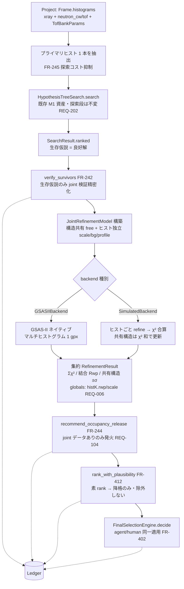
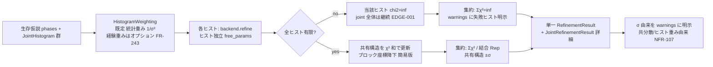
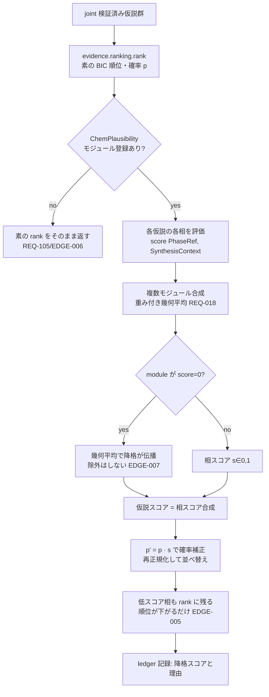
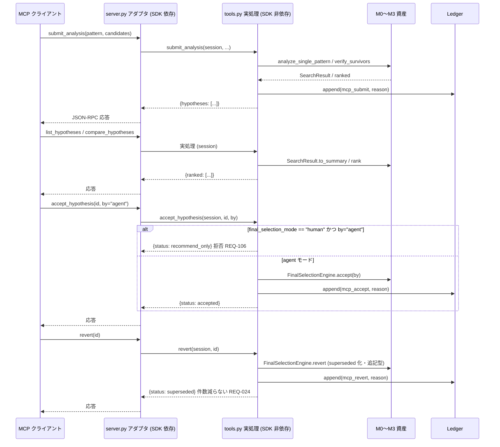
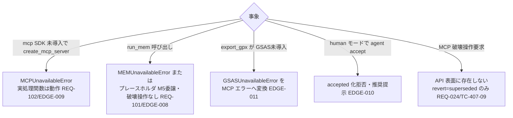

# m4-joint-mcp データフロー図

**作成日**: 2026-07-04
**関連**: [architecture.md](architecture.md) / [requirements.md](../../spec/m4-joint-mcp/requirements.md)

**【信頼性レベル凡例】**: 🔵 要件・仕様に依拠 / 🟡 妥当な推測 / 🔴 根拠なし推測

---

## M4 全体フロー (探索プライマリ → joint 検証 → コントラスト → 降格 → 選択) 🔵

**信頼性**: 🔵 *FR-245 → FR-242 → FR-244 → FR-412 → FR-402 の順序*



## joint 検証精密化のフロー 🔵



## コントラスト占有率解放判定のフロー 🔵

```mermaid
flowchart TD
    A{joint データあり?\nヒスト≥2 かつ probe種別≥2} -->|no| B[提案空・警告なく続行\nREQ-104/EDGE-004]
    A -->|yes| C[各サイトの占有元素対 A,B]
    C --> D[f_norm = f_A/f_A+f_B  Z近似\nb_norm = b_A/|b_A|+|b_B|  静的表]
    D --> E{|f_norm − b_norm| ≥ 閾値?\n既定 0.15}
    E -->|no| F[コントラスト不十分\n提案しない]
    E -->|yes| G[占有率解放を戦略へ追加提案\nglobal.occ.site 命名]
    F --> H{全サイト閾値未満?}
    H -->|yes| I[提案空・警告なく続行\nREQ-103/EDGE-003]
    G --> J[ledger 記録: どのサイトをなぜ\ncontrast_occupancy_recommend REQ-012]
    J --> K[自動適用しない・推奨のみ\nREQ-011/TC-404-06]
```

## ChemPlausibility 降格 rank のフロー 🔵

**最重要不変条件**: 降格のみ・候補除外しない (Dara 教訓, REQ-019)



## MCP submit → list → compare → accept → revert のフロー 🔵



## MCP 縮退・境界のフロー 🔵



## データ整合性 🔵

- joint 昇格・コントラスト提案・ChemPlausibility 降格・MCP 全操作は ledger に理由付き記録 (P2/NFR-105)
- ChemPlausibility 降格で候補は削除されない — 順位が下がるのみ (Dara 教訓・REQ-019)
- MCP `revert` は superseded 化 (追記型)。accept 履歴は残り件数は減らない (REQ-024)
- コントラスト提案・run_mem は状態を書き換えない (推奨/委譲のみ・自動適用なし)
- joint のヒスト欠損・失敗は chi2=inf として明示 (捏造しない)

## 信頼性レベルサマリー

- 🔵: 6 フロー / 🟡: 0 (詳細閾値は architecture.md D4/D5 へ集約) / 🔴: 0 — **品質評価**: 高品質
