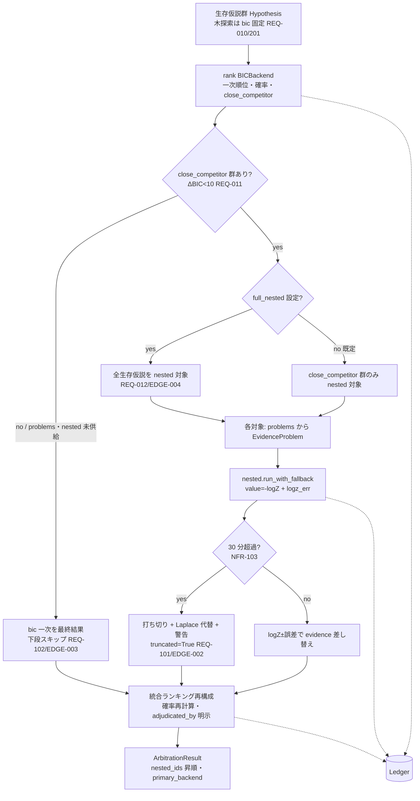
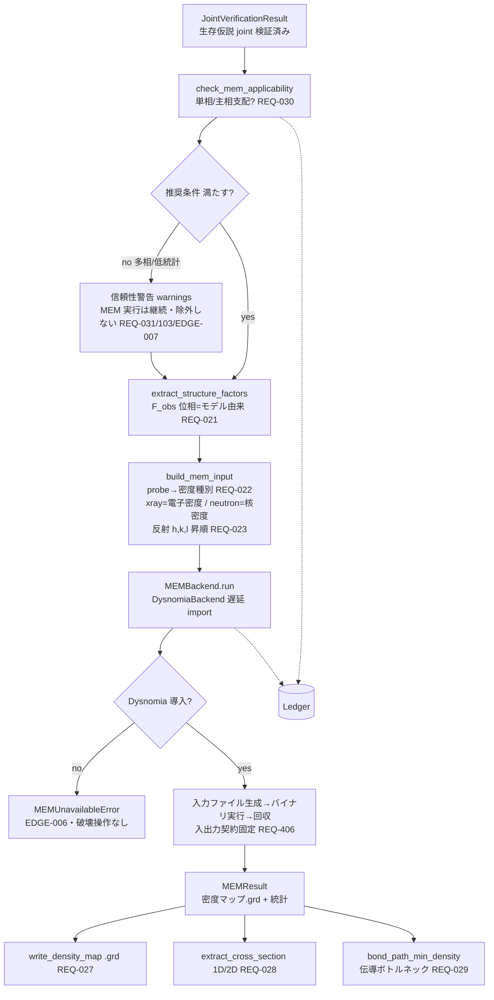
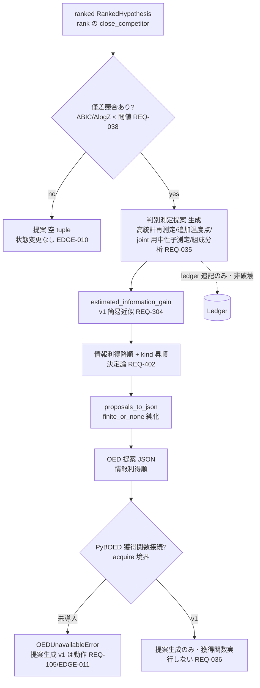
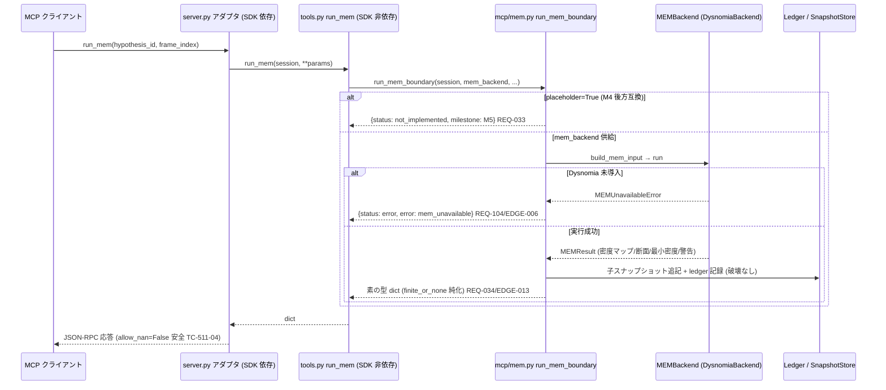
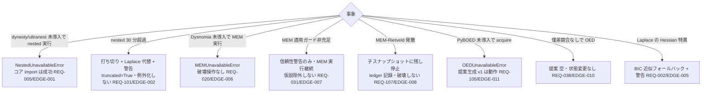

# m5-nested-mem-oed データフロー図

**作成日**: 2026-07-04
**関連**: [architecture.md](architecture.md) / [requirements.md](../../spec/m5-nested-mem-oed/requirements.md)

**【信頼性レベル凡例】**: 🔵 要件・仕様に依拠 / 🟡 妥当な推測 / 🔴 根拠なし推測

---

## (a) 階層的裁定フロー (bic 一次 → 競合抽出 → nested 再裁定 → 統合) 🔵

**信頼性**: 🔵 *FR-122 / REQ-010〜013/102/201 — 探索段 bic 固定・僅差競合のみ nested*



- **決定論**: 仮説 ID 昇順で処理。nested は種固定 + logZ±誤差 (ビット同一でなく誤差範囲一致, EDGE-014)。
- **記録 (REQ-013)**: どの仮説を bic 一次で確定し、どの競合を nested 再裁定したかを理由付きで ledger 追記。

## (a') 確率較正フロー (reliability diagram / ECE, bic/nested 別系列) 🔵

```mermaid
flowchart LR
    A[較正ベンチ CalibrationSample\n予測確率・真偽・backend] --> B[calibrate_by_backend\nbackend で系列分離 REQ-016/106]
    B --> C[bic 系列]
    B --> D[nested 系列 EDGE-012]
    C --> E[reliability_diagram\n等幅ビン・下端昇順 REQ-017]
    D --> F[reliability_diagram]
    E --> G[expected_calibration_error\nΣ count/N·|acc−conf|]
    F --> H[expected_calibration_error]
    G --> I[CalibrationReport backend=bic\nprobability_semantics=BIC 近似]
    H --> J[CalibrationReport backend=nested\nprobability_semantics=logZ NFR-004]
```

## (b) MEM 解析フロー (joint 結果 → F_obs → MEM 入力 → Dysnomia → 密度/断面/ボンド経路) 🔵

**信頼性**: 🔵 *FR-600〜606 / REQ-021〜031*



## (c) MEM-Rietveld 反復ループ (既定オフ・子スナップショット追記) 🔵

**信頼性**: 🔵 *FR-603 / REQ-024/025/026/107/202 — 親不変・追記のみ*

```mermaid
flowchart TD
    A[run_mem_rietveld] --> B{config.enabled?\n既定オフ REQ-024}
    B -->|no| C[stop_reason=disabled\n即返し・反復しない]
    B -->|yes| D[反復 iter=0]
    D --> E[MEM 密度 → F_calc 更新 → 再精密化\nMPF サイクル]
    E --> F[snapshots.save 子スナップショット追記\nlabel=mem_rietveld_iter{n} REQ-025/202]
    F --> G{発散?\n密度負値/R 悪化 REQ-107}
    G -->|yes| H[当該サイクルは子に残し停止\nstop_reason=diverged\nledger 記録 EDGE-008]
    G -->|no| I{収束?\nR/密度変化 < tol REQ-026}
    I -->|yes| J[stop_reason=converged\nledger 記録]
    I -->|no| K{max_iter 到達?}
    K -->|yes| L[stop_reason=max_iter\nledger 記録 EDGE-009]
    K -->|no| M[iter += 1]
    M --> E
    F -.-> S[(SnapshotStore 追記型)]
    H -.-> Z[(Ledger)]
    J -.-> Z
    L -.-> Z
```

- **親不変 (REQ-202/NFR-005)**: 元 joint 精密化済み仮説 (親スナップショット) は書き換えない。
- **P2**: SnapshotStore は save/revert のみ (削除/上書き API なし)。ロールバックは revert 経由・破壊しない。

## (d) OED 提案フロー (僅差競合 → 測定提案 JSON) 🔵

**信頼性**: 🔵 *FR-431/432 / REQ-035/037/038/EDGE-010 — 非破壊・提案のみ*



- **非破壊 (REQ-037)**: 仮説の accepted/rejected 化・データ改変を一切伴わない。ledger 追記記録のみ (P2)。

## (e) run_mem MCP フロー (MEMBackend 実体化) 🔵

**信頼性**: 🔵 *FR-513 / REQ-033/034/104/EDGE-006/013 — placeholder 契約維持・破壊操作なし*



## nested/mem/oed 縮退・境界のフロー 🔵



## データ整合性 🔵

- nested 裁定振り分け・MEM 反復サイクル・OED 提案・較正結果は ledger に理由付き記録 (P2/NFR-105)。
  `ledger.verify()` は M5 全操作を通しても常時 True (TC-514-01)。
- MEM 適用ガードで仮説は除外されない — 警告が付くのみ (Dara 教訓・REQ-031)。
- MEM-Rietveld 反復は子スナップショット追記 (親 joint 結果は不変)。削除/上書き API なし (REQ-202/P2)。
- OED 提案・run_mem・nested 裁定は生データを書き換えない (推奨/評価/委譲のみ・自動適用なし)。
- nested の logZ は種固定でも確率的 → ビット同一でなく logZ±誤差で再現性を保証 (NFR-102 の nested 例外)。
- nested 打ち切り・MEM 未導入・Laplace 特異・OED 未導入は例外を上げず縮退値/error dict で解析を止めない。

## 信頼性レベルサマリー

- 🔵: 7 フロー / 🟡: 0 (数値閾値・MPF 詳細は architecture.md D2/D3/D5/D6 へ集約) / 🔴: 0 — **品質評価**: 高品質
