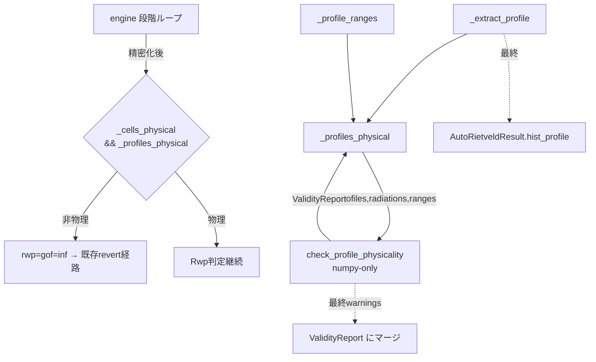

# プロファイル物理性ガード アーキテクチャ設計

**作成日**: 2026-07-09
**関連要件定義**: [requirements.md](../../spec/profile-physicality-guard/requirements.md)
**ヒアリング記録**: [design-interview.md](design-interview.md)

**【信頼性レベル凡例】**: 🔵 確実 / 🟡 妥当な推測 / 🔴 資料にない推測

---

## ⚠ 実装中の設計改訂 (GSAS getFWHM 精読 + T1 実測) 🔵

**信頼性**: 🔵 *GSAS-II `GSASIIpwd.getFWHM` (L915-964) 精読 + T1 実測*

当初「CW 幅関数 H_G²>0 とローレンツ X,Y≥0 を hard 判定 (revert)」で実装したが、**T1 が Rwp 9.83%→12.85% に
回帰**した。原因は GSAS の実挙動:
- **ガウス分散はクランプされる**: `sig = sqrt(max(0.001, U·tan²θ+V·tanθ+W))`。U,V,W が負で H_G² が負でも
  GSAS は 0.001 を下駄履きするため非物理でない。実 T1 は **U=-1.96 に収束** (良好フィット)。
- **ローレンツ負値も許容**: 総 FWHM は Thompson-Cox-Hastings 合成で反射位置でのみ評価され、X,Y 負でも
  問題にならない。実 T1 は **Y=-3.13 に収束**。
- **TOF は別**: `sigTOF = sqrt(S0+S1d²+S2d⁴+…)` は**クランプなし** → σ²<0 で NaN (真の非物理)。alpha/beta は
  `1/α`,`1/β` で発散するため strict>0 が有効。

**改訂**: hard (revert) は**真の発散のみ** = (a) 解放済値の NaN/inf (全放射源), (b) TOF σ²<0, (c) TOF
alpha/beta-0≤0。CW 係数・SH/L は **soft 警告**。TOF hard は TOF プロファイル解放時のみ発火するため、
TOF プロファイルを解放しない T1〜T4 は**構造的に非回帰**。この改訂で T1 は 9.83% に回復。

## システム概要 🔵

**信頼性**: 🔵 *要件定義・engine/validity 精読*

段階解放エンジン (`autorietveld.engine`) の revert 判定に、格子崩壊ガード `_cells_physical` と**同格**の
プロファイル物理性ガードを追加する。判定ロジックは純関数 `check_profile_physicality`
(`autorietveld.validity`, numpy-only) に集約し、engine は (a) GSAS からのプロファイル値抽出、
(b) 1 行のガード呼び出し、(c) `hist_profile` 内省フィールドの充填のみを担う。

## アーキテクチャパターン 🔵

**信頼性**: 🔵 *既存 `_cells_physical`/`check_validity` の踏襲*

- **パターン**: 純関数コア + 薄い GSAS アダプタ (既存 M7 の設計方針)。
- **選択理由**: 物理判定を GSAS 非依存の純関数にすることで numpy 決定論テストが可能 (NFR-101)。
  engine は GSAS 依存の抽出と配線のみ。責務分離により validity.py に物理知識を集約。

## コンポーネント構成

### 純関数コア (numpy-only) 🔵

**信頼性**: 🔵 *ユーザ入力設計(2)*

- `validity.check_profile_physicality(*, profiles, radiations, ranges, ...) -> ValidityReport`
  - CW/TOF を放射源で分岐し、幅関数正値性・符号・strict-pos を判定。
  - `passed` = **hard** チェック全通過 (revert 用)、`warnings` = **soft** 上限逸脱。
  - **解放済 (refined=True) パラメータのみ hard**、未解放の関数正値性違反は warning (REQ-102/202)。
- 内部ヘルパ (module-private, numpy):
  - `_gauss_min_over_range(U, V, W, two_theta_lo, two_theta_hi) -> float`: `H_G²` の区間最小値
    (端点 + レンジ内頂点 `tanθ*=-V/2U`)。
  - `_tof_sigma_min_over_range(s0, s1, s2, d_lo, d_hi) -> float`: `σ²(d²)` の区間最小値
    (`x=d²` の2次式, `x*=-s1/2s2` がレンジ内なら頂点も評価)。

### GSAS アダプタ (engine 内, 遅延 import) 🔵

**信頼性**: 🔵 *engine 精読*

- `_extract_profile(g2hists) -> tuple[dict[str, tuple[float, bool]], ...]`: 各 hist の
  `Instrument Parameters[0][key] = [default, value, refine]` から `{key:(value,refined)}` を抽出。
  欠落は空 dict に縮退 (EDGE-001)。
- `_profile_ranges(g2hists, radiations, profiles) -> tuple[tuple[float,float]|None, ...]`:
  各 hist の評価レンジ。CW は `getdata("x")` の 2θ° min/max、TOF は TOF μs を
  `d≈(t-Zero)/difC` で d に換算。取得不能は None (当該 hist のレンジ判定 skip, EDGE-003)。
- `_profiles_physical(g2hists, radiations) -> ValidityReport`: 上記を束ね
  `check_profile_physicality` を呼ぶ薄いラッパ。

### engine 段階ループへの配線 🔵

**信頼性**: 🔵 *engine.py:622/635 精読*

```python
# 精密化直後 (engine.py:620 付近)
prof_report = _profiles_physical(g2hists, radiations)
if not _cells_physical(g2phases) or not prof_report.passed:
    rwp, gof, converged = float("inf"), float("inf"), False
```
最終結果構築時 (engine.py:699):
- `hist_profile = tuple({k: v for k, (v, _) in d.items()} for d in _extract_profile(g2hists))`
- 最終状態で `check_profile_physicality` を再評価し、その `warnings`/`checks` を `validity` にマージ
  (REQ-103 soft 上限を結果へ残す)。

## システム構成図



## 非機能要件の実現方法

### 決定論 🔵
- `check_profile_physicality` は浮動小数の決定的演算のみ。乱数/辞書順依存なし (キーは明示列挙)。

### 保守性 🔵
- 物理判定は validity.py に集約。engine 変更は抽出2関数 + ラッパ1関数 + ガード1行 + 構築2行に限定。

### 非回帰 (T1〜T4) 🔵
- ガードは `_profiles_physical.passed=True` (物理的) のとき従来と完全に等価 (Rwp 判定のみ)。
  既定 tol は既存 instprm 値 (`U:2,V:-2,W:5,SH/L:0.002` 等) を物理と判定するよう設定。

## 技術的制約 🔵
- numpy コア + GSAS 遅延 import (CLAUDE.md)。`check_profile_physicality` は GSAS を import しない。
- accept/revert 基本構造は不変 (REQ-403)。

## 関連文書
- **データフロー**: [dataflow.md](dataflow.md)
- **型定義**: [interfaces.py](interfaces.py)
- **要件定義**: [requirements.md](../../spec/profile-physicality-guard/requirements.md)

## 信頼性レベルサマリー
- 🔵 青信号: 100%

**品質評価**: 高品質
