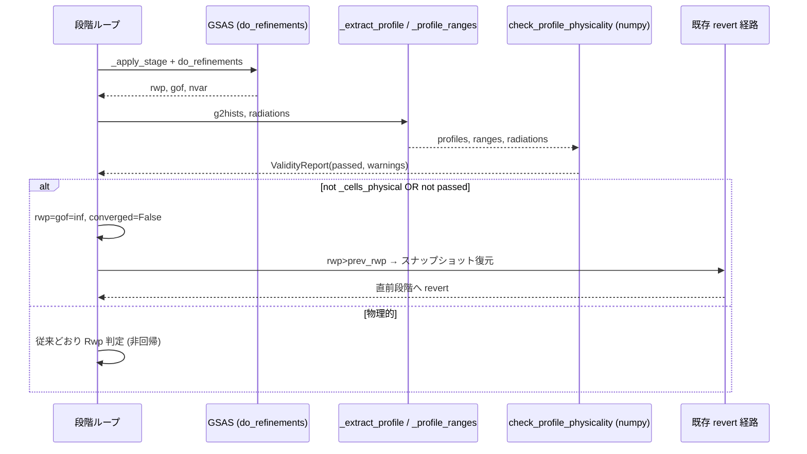
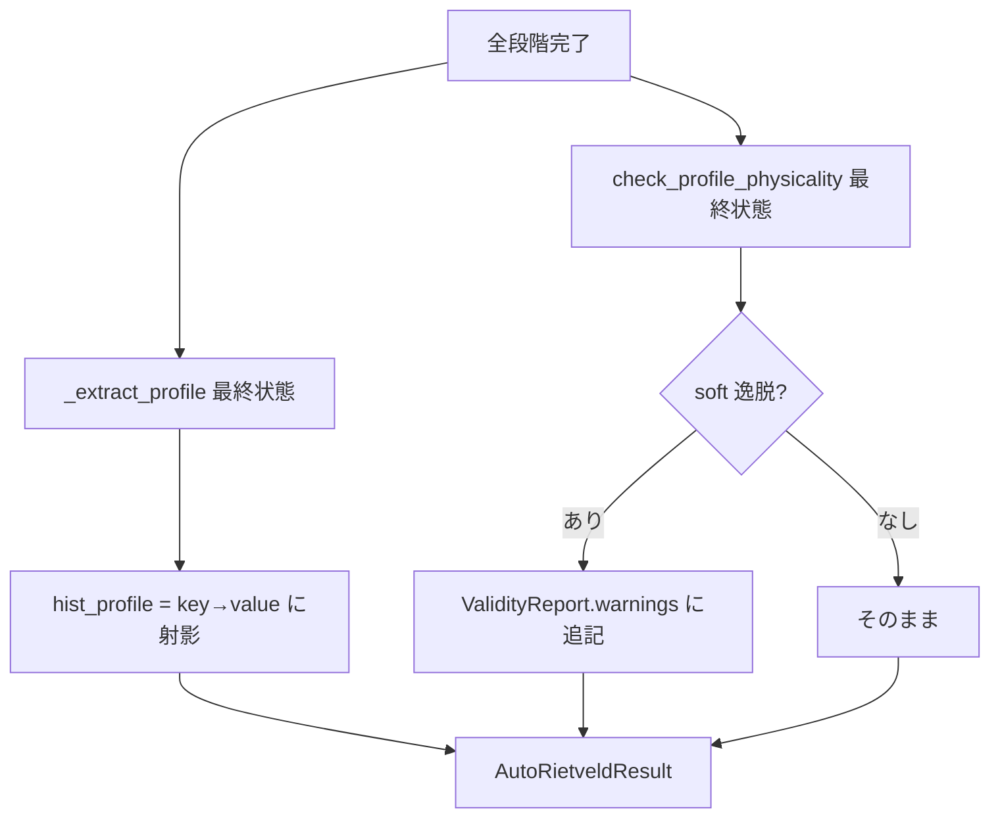
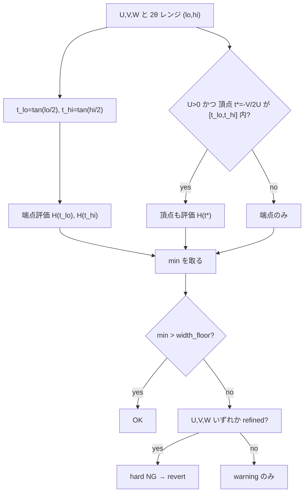
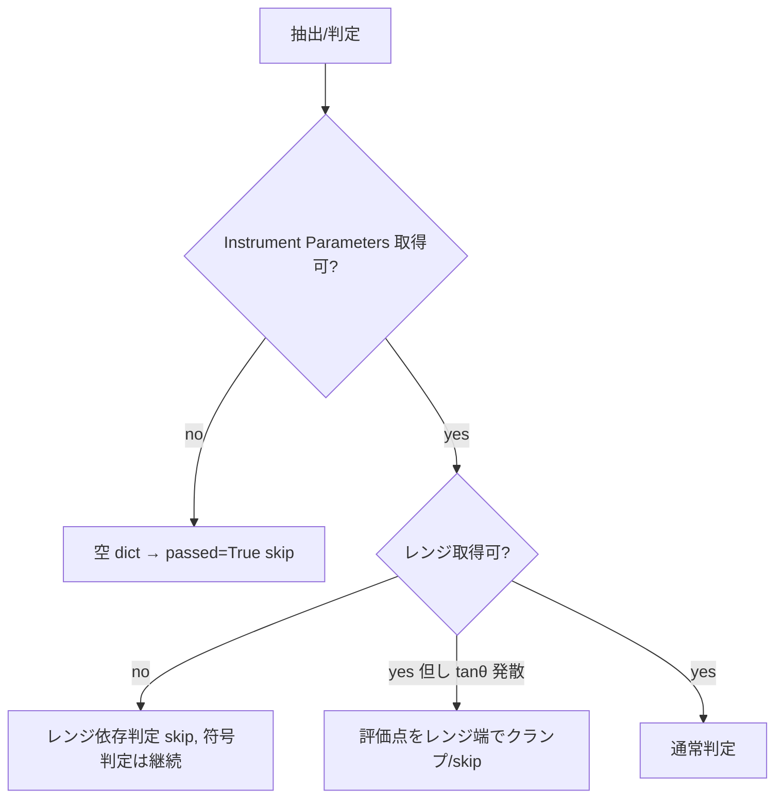

# プロファイル物理性ガード データフロー

**作成日**: 2026-07-09
**関連アーキテクチャ**: [architecture.md](architecture.md)

**【信頼性レベル凡例】**: 🔵 確実 / 🟡 妥当な推測 / 🔴 資料にない推測

---

## 段階ループ内の revert 判定フロー 🔵

**信頼性**: 🔵 *engine.py:609-661 精読*

## hist_profile 充填と警告マージ (最終結果) 🔵

**信頼性**: 🔵 *engine.py:673-711 精読*

## 幅関数正値性の評価 (CW ガウス) 🔵

**信頼性**: 🔵 *Caglioti / 2次関数の区間最小*

## エラー処理フロー 🔵

**信頼性**: 🔵 *EDGE-001/002/003 + check_bond_validity 縮退流儀*

## 状態管理 🔵

**信頼性**: 🔵 *engine スナップショット機構 (既存)*

- revert は既存の `.gpx` スナップショット復元で行う。本機能は「非物理 → rwp=inf」への変換のみ足し、
  復元自体は既存経路が担う (新しい状態遷移を導入しない)。

## 信頼性レベルサマリー
- 🔵 青信号: 100%

**品質評価**: 高品質
