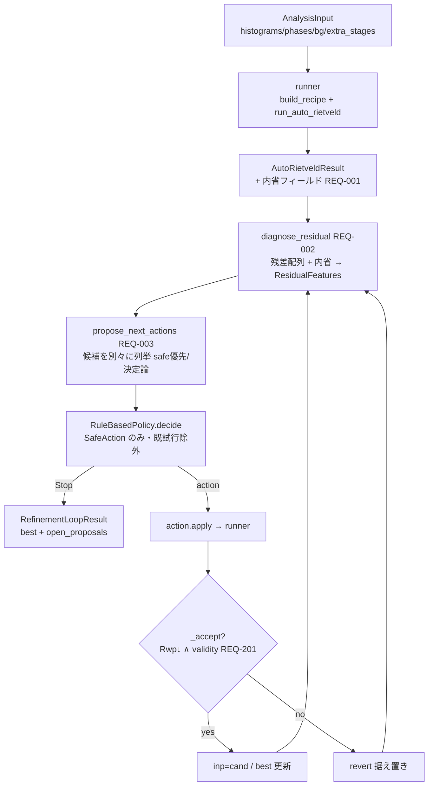
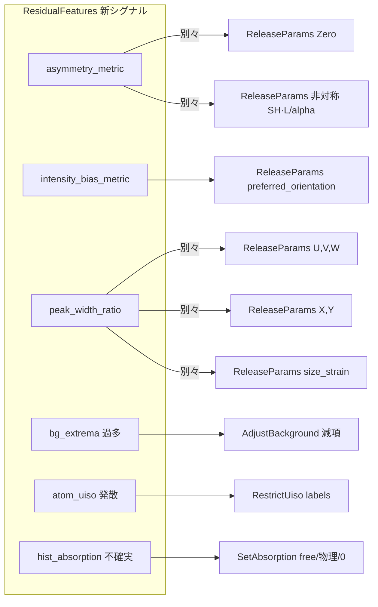
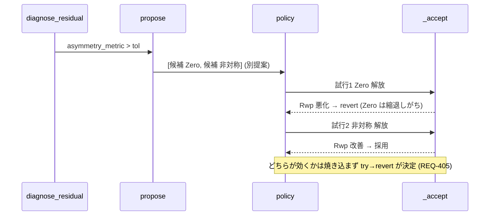
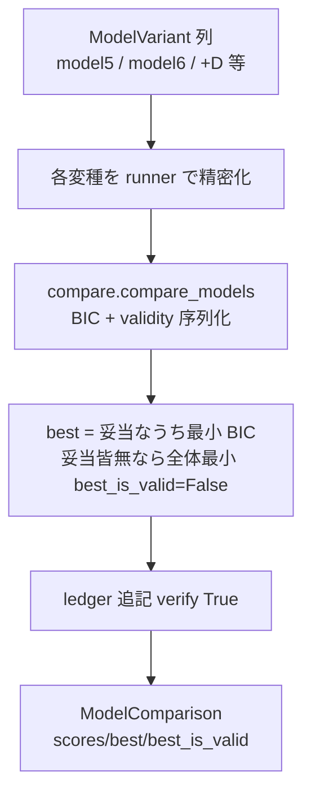
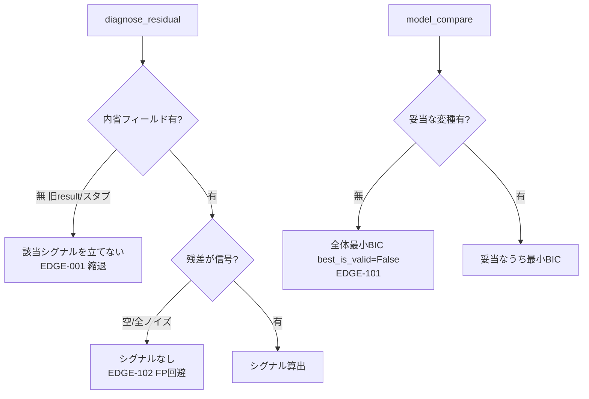

# refine-loop-diagnostics データフロー

**作成日**: 2026-07-09
**関連アーキテクチャ**: [architecture.md](architecture.md)
**関連要件定義**: [requirements.md](../../spec/refine-loop-diagnostics/requirements.md)

**【信頼性レベル凡例】**: 🔵 要件/設計/実装参照 / 🟡 妥当な推測 / 🔴 未参照推測

---

## 全体: 閉ループ (第2層b) のデータフロー 🔵

**信頼性**: 🔵 *orchestrator.run_refinement_loop 現行 + 拡張点*

**拡張点** (本要件): 🔵
- `runner` が `AutoRietveldResult` に**内省フィールド**を詰める (REQ-001)。
- `diagnose_residual` が背景のみの粗診断を置換し、**多シグナル**を算出 (REQ-002)。
- `propose_next_actions` が新シグナルに対し**別々の候補**を列挙 (REQ-003/101〜106)。
- `_accept`・`policy`・ループ制御は**不変** (核心原理保持)。

## 診断シグナル → トライ候補の対応 🔵

**信頼性**: 🔵 *serious-flow §6・GAP 表B より*

各候補は独立提案。policy が優先度順に 1 つ試し `_accept` が採否 → 「別々に試して観察」を実現
(REQ-003, DD-2)。経験則 prior は priority を偏らせるのみ (REQ-301, DD-4)。

## 非対称/位置の切り分けシーケンス 🔵

**信頼性**: 🔵 *serious-flow §6 の切り分け手順より*

## 第3層: モデル比較オーケストレータ 🔵

**信頼性**: 🔵 *REQ-005/202・compare_models 現行より*

単一モデル調律ループ (`run_refinement_loop`) の**外側**。各変種の精密化に既存 runner を用い、
序列化は `compare_models` に委譲 (DD-6)。

## エラー/縮退フロー 🔵

**信頼性**: 🔵 *EDGE ケースより*

## 関連文書

- **アーキテクチャ**: [architecture.md](architecture.md)
- **型定義**: [interfaces.py](interfaces.py)
- **要件定義**: [requirements.md](../../spec/refine-loop-diagnostics/requirements.md)

## 信頼性レベルサマリー

- 🔵 青信号: 全フロー (要件 + 既存実装に追跡可能)
- 🟡/🔴: 0

**品質評価**: 高品質
